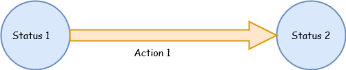
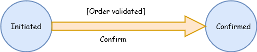
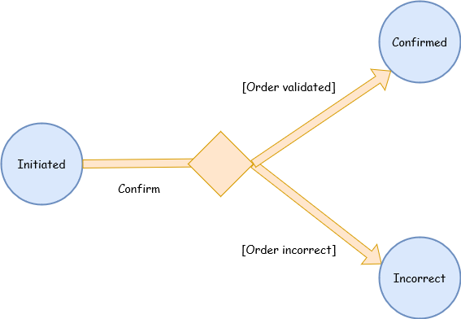
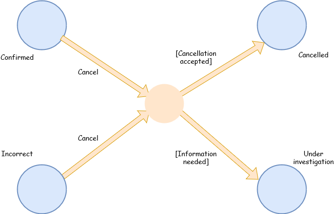
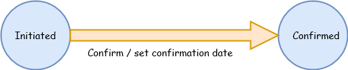

# Tradista Flow


Tradista Flow is a simple Java Workflow engine that can be included in any Java application.
Tradista Flow allows to create/update/delete workflows and execute them.

Tradista Flow is available in Maven Central, it can be added to your project by adding this in your pom.xml file:

```xml
<dependency>
  <groupId>finance.tradista.flow</groupId>
  <artifactId>tradista-flow</artifactId>
  <version>4.0.0</version>
</dependency>
```

## Create and save a workflow very easily:


### A simple workflow:
<br/>



```java
Workflow wkf = new Workflow("SampleWorkflow");
Status statusOne = new Status(wkf, "s1");
Status statusTwo = new Status(wkf, "s2");
Action actionOne = new Action(wkf, "a1", statusOne, statusTwo);
WorkflowManager.saveWorkflow(wkf);
```

### A workflow with a guard:
<br/>
It is possible with Tradista Flow to define conditions linked to actions, it is the concept of "guard".
The objects go to the target status only if the condition defined in the guard is OK.
<br/>
<br/>



Define the guard: 
```java
@Entity
public class OrderValidated extends Guard<Order> {

	private static final long serialVersionUID = -4945718662266443702L;

	public OrderValidated() {
		setPredicate(order -> {
			order.isValidated();
		});
	}

}
```
Define the workflow:

```java
Workflow wkf = new Workflow("SampleWorkflow");
Status initiated = new Status(wkf, "Initiated");
Status confirmed = new Status(wkf, "Confirmed");
OrderValidated orderValidated = new OrderValidated();
Action actionOne = new Action(wkf, "Confirm", initiated, confirmed, orderValidated);
WorkflowManager.saveWorkflow(wkf);
```

### A workflow with a condition:
<br/>
You can also define branching in your workflows, as illustrated in the example below.
<br/>
<br/>



Define the condition:

```java
@Entity
public class OrderCondition extends Condition<Order> {

	private static final long serialVersionUID = -4945718662266443702L;

	public OrderCondition() {
		setFunction(order -> {
			if (order.isValidated()) {
				return 1;
			} else {
				return 2;
			}			
		});
	}

}
```

Define the workflow:

```java
Workflow wkf = new Workflow("SampleWorkflow");
Status initiated = new Status(wkf, "Initiated");
Status confirmed = new Status(wkf, "Confirmed");
Status incorrect = new Status(wkf, "Incorrect");
OrderCondition orderCondition = new OrderCondition();
Map<Integer, Status> conditionalRouting = new HashMap<Integer, Status>();
conditionalRouting.put(1, confirmed);
conditionalRouting.put(2, incorrect);
Action action = new ConditionalAction(wkf, initiated, "Confirm", orderCondition, conditionalRouting, confirmed, incorrect);
WorkflowManager.saveWorkflow(wkf);
```

### A workflow with a junction:
<br/>
There may be more complex branching actions: junctions with several inbound and outbound actions.
This can also be covered with Tradista Flow, please see the example below.
<br/>
<br/>



Define the condition:

```java
@Entity
public class CancellationCondition extends Condition<Order> {

	private static final long serialVersionUID = -4945718662266443712L;

	public CancellationCondition() {
		setFunction(order -> {
			if (order.isDirectlyCancellable()) {
				return 1;
			} else {
				return 2;
			}			
		});
	}

}
```

Define the workflow:

```java
Workflow wkf = new Workflow("SampleWorkflow");
...
Status confirmed = new Status(wkf, "Confirmed");
Status incorrect = new Status(wkf, "Incorrect");
Status cancelled = new Status(wkf, "Cancelled");
Status underInvestigation = new Status(wkf, "Under Investigation");
CancellationCondition cancellationCondition = new CancellationCondition();
Map<Integer, Status> conditionalRouting = new HashMap<Integer, Status>();
conditionalRouting.put(1, cancelled);
conditionalRouting.put(2, underInvestigation);
Set<SimpleAction> departureActions = new HashSet<>();
departureActions.add(new SimpleAction(wkf, "Cancel", confirmed));
departureActions.add(new SimpleAction(wkf, "Cancel", incorrect));
Action action = new ConditionalAction(wkf, departureActions, cancellationCondition, conditionalRouting, cancelled, underInvestigation);
WorkflowManager.saveWorkflow(wkf);
```
### A workflow with a process:
<br/>
You can also add process to an action. Processes are executed when an action is applied (if the action has a guard, the process is executed after the guard condition execution, and only if the condition is Ok).
<br/>
<br/>



Define the process: 
```java
@Entity
public class OrderConfirmation extends Process<Order> {

	private static final long serialVersionUID = -4945718662266443702L;

	public OrderConfirmation() {
		setTask(order -> {
			order.setConfirmationDate(LocalDateTime.now());
		});
	}

}
```
Define the workflow:

```java
Workflow wkf = new Workflow("SampleWorkflow");
Status initiated = new Status(wkf, "Initiated");
Status confirmed = new Status(wkf, "Confirmed");
OrderConfirmation orderConfirmation = new OrderConfirmation();
Action action = new ConditionalAction(wkf, "Confirm", initiated, confirmed, orderConfirmation);
WorkflowManager.saveWorkflow(wkf);
```
### Link your objects to a workflow thanks to the WorkflowObject interface:
<br/>

```java
public class Order implements WorkflowObject {

	private Status status;
	
	private String workflow;

        ...

	@Override
	public void setStatus(Status status) {
		this.status = status;
	}

	@Override
	public String getWorkflow() {
		return workflow;
	}
	
	public void setWorkflow(String name) {
		this.workflow = name;
	}

	@Override
	public Status getStatus() {
		return status;
	}

        @Override
	public Order clone() throws CloneNotSupportedException {
		// cloning code
	} 
  
        ...  
  
}
```

### Execute a workflow action on your objects:
<br/>

```java
Order order = new Order();
order.setWorkflow("SampleWorkflow");
order.setStatus(initiated);
order = WorkflowManager.applyAction(order, "Confirm");
```

Tradista Flow is based on JPA. It can be used in JTA or non JTA mode.
It can be configured using a persistence.xml file in your classpath, please find below a sample in non JTA mode (JTA mode is commented),
using Hibernate and Derby:

```xml
<?xml version="1.0" encoding="UTF-8"?>
<persistence xmlns="https://jakarta.ee/xml/ns/persistence" xmlns:xsi="http://www.w3.org/2001/XMLSchema-instance" version="3.0">
    <persistence-unit name="tradista-flow-persistence-unit" transaction-type="RESOURCE_LOCAL">
        <description>This is the unique persistence unit of the tradista flow project.</description>
        <class>finance.tradista.flow.model.Workflow</class>
	<class>finance.tradista.flow.model.Action</class>
	<class>finance.tradista.flow.model.SimpleAction</class>
	<class>finance.tradista.flow.model.ConditionalAction</class>
	<class>finance.tradista.flow.model.Condition</class>
	<class>finance.tradista.flow.model.Guard</class>
	<class>finance.tradista.flow.model.Process</class>
	<class>finance.tradista.flow.model.Status</class>
        <class>finance.tradista.flow.model.PseudoStatus</class>
	<class>finance.tradista.flow.model.TradistaFlowObject</class>
        <properties>
            <property name="jakarta.persistence.jdbc.driver" value="org.apache.derby.jdbc.EmbeddedDriver" />
            <property name="jakarta.persistence.jdbc.url" value="jdbc:derby:memory:TradistaFlow;create=true" />
            <property name="jakarta.persistence.jdbc.user" value="xxxxx" />
            <property name="jakarta.persistence.jdbc.password" value="xxxxx" />
            <property name="hibernate.dialect" value="org.hibernate.dialect.DerbyDialect"/>
            <property name="hibernate.show_sql" value="true"/>
            <property name="jakarta.persistence.schema-generation.database.action" value="drop-and-create"/>
        </properties>
    </persistence-unit>
    <!--<persistence-unit name="tradista-flow-persistence-unit" transaction-type="JTA">
        <description>This is the unique persistence unit of the tradista flow project.</description>
        <jta-data-source>java:/myAppDS</jta-data-source>
        <class>finance.tradista.flow.model.Workflow</class>
	<class>finance.tradista.flow.model.Action</class>
	<class>finance.tradista.flow.model.SimpleAction</class>
	<class>finance.tradista.flow.model.ConditionalAction</class>
	<class>finance.tradista.flow.model.Condition</class>
	<class>finance.tradista.flow.model.Guard</class>
	<class>finance.tradista.flow.model.Process</class>
	<class>finance.tradista.flow.model.Status</class>
	<class>finance.tradista.flow.model.PseudoStatus</class>
	<class>finance.tradista.flow.model.TradistaFlowObject</class>
        <properties>
            <property name="hibernate.dialect" value="org.hibernate.dialect.DerbyDialect"/>
            <property name="hibernate.show_sql" value="true"/>
            <property name="jakarta.persistence.schema-generation.database.action" value="drop-and-create"/>
        </properties>
    </persistence-unit>-->
</persistence>
```

# Dependencies
Tradista Flow is made possible using powerful third party tools:
- [Apache Commons](https://commons.apache.org/) for various common needs
- [Apache Derby](https://db.apache.org/derby/) as database provider for test of the persistence layer
- [Apache Log4j](https://logging.apache.org/log4j/2.x/) for logging 
- [Apache Maven](https://maven.apache.org/) for the build
- [Hibernate](https://hibernate.org/) as JPA provider for test of the persistence layer
- [JGraphT](https://jgrapht.org) for graph modeling
- [JReleaser](https://jreleaser.org) for publication of the releases on Maven Central 
- [JUnit](https://junit.org/junit5) for unit testing
